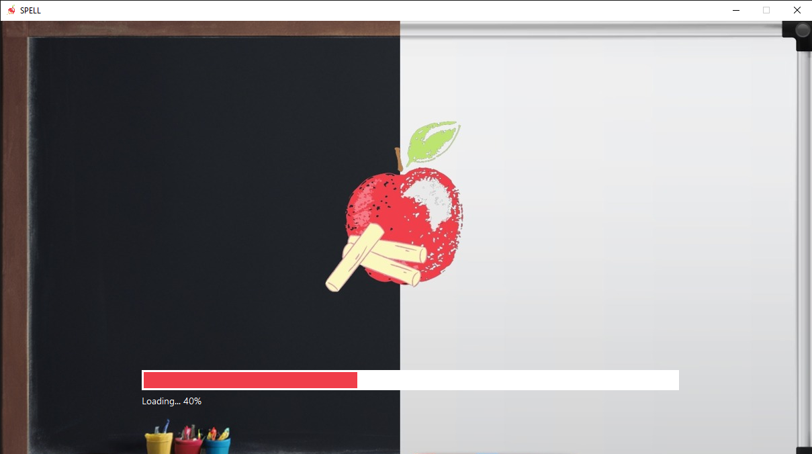
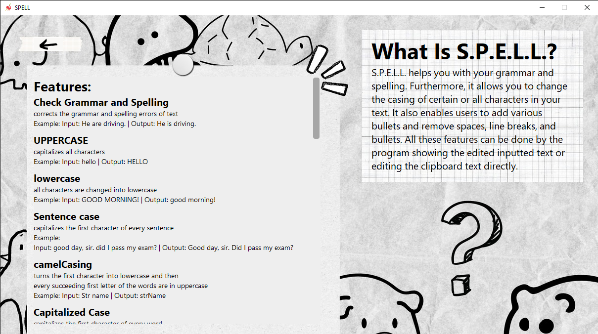
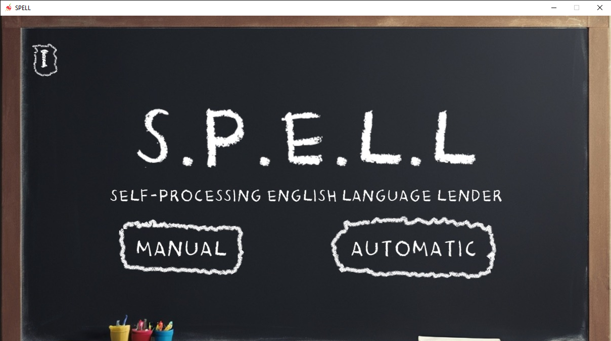
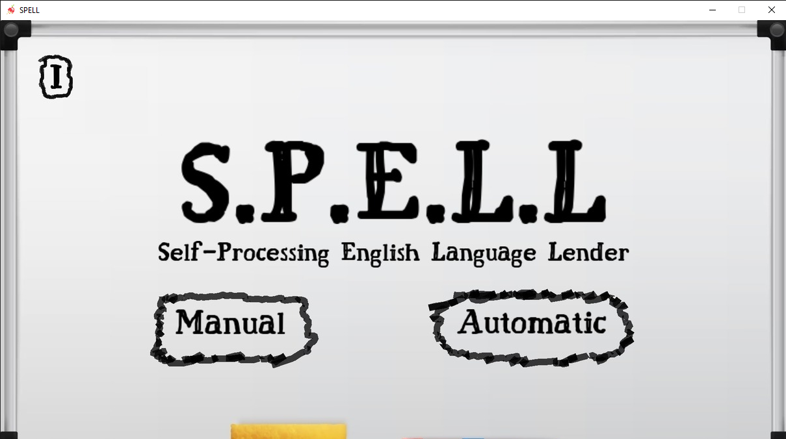
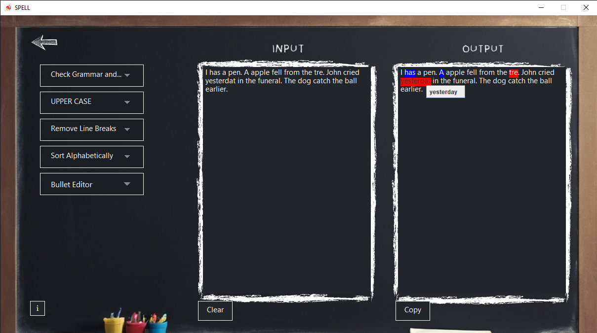
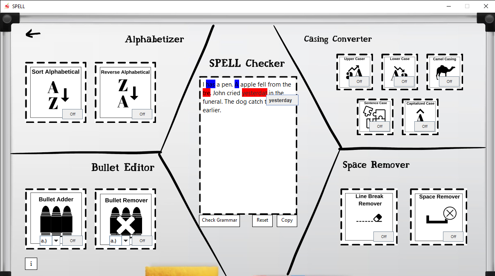

# SPELL-Self-Processing-English-Language-Lender

  

## A Java Swing desktop app that can manually and automatically edit text, and also provides grammar checking and spelling correction.

* SPELL desktop application was our case study program for Object Oriented Programming (OOP)
* It processes text and performs different formatting such as case converter, space remover, alphabetizer, and bullet editor
* Additionally it can check strings of text for grammar and spelling errors powered by the [LanguageTool API](https://github.com/languagetool-org/languagetool)
* Automatic editing works with these steps:
1. When a certain editing panel is on (e.g. UPPERCASE panel) a looping thread (sleeps every 500ms) starts to continuously check the clipboard to process when the user copies or cuts a text. 
2. If the thread detects changes, it means that the user copied a text. The editor will now get the string copied from the clipboard, formats the text in the background, and brings it back to the clipboard
3. So now when the user pastes the text in any text areas, the user will now see the edited output.

## Instructions
### To use the app
* download the [SPELL_Installer.exe](https://github.com/Aron-Arboleda/SPELL-Self-Processing-English-Language-Lender/blob/main/dist/SPELL_Installer.exe) file under the dist folder, and install the application.
* it will redirect you to the installer file's directory in this repository. Click the download button on the right side, wait for a few seconds, and the download progress should pop up at the top. It will display a lot of caution and warning messages because i don't know for the life of me how to make the program to be recognized as a safe application (sorry i'm a noob at deploying apps) but just click the "keep anyway" button or anything else to continue downloading the file. Then when the file is downloaded, you can run the installer, it will ask for admin priviledges to run the file(because it will place the program on the Program Files folder of your pc, it needs permission to do that), then windows defender thing will pop up, saying it's not a safe file or something, just click "More info" and continue the application installment. Go through the installer and after that, the program should be installed on your end.
## Features still in development
* Bugs Fixing
* Adding a database to apply history feature

## SPELL Team
Front-end Designers:
* [Lester](https://github.com/L-E-S-T-E-R)
* [Alex](https://www.instagram.com/lexsusicat)

Back-end Handlers:
* [Aron](https://github.com/Aron-Arboleda)
* [Hannah](https://github.com/404hannah)

Documentation:
* [Jenny](https://www.instagram.com/jentiglao_)
* [Victoria](https://github.com/vic-7oria)

## Images

  
  

  
  

  

  

 &copy; 2024 Aron-Arboleda. All rights reserved.
